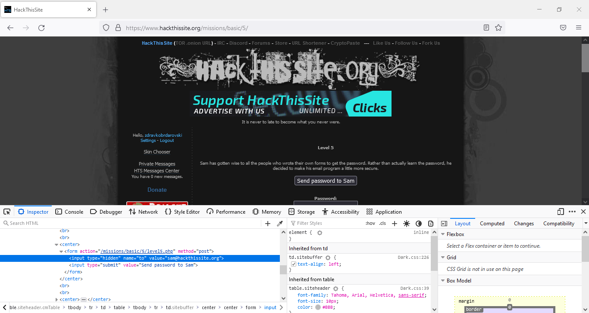

**HackThisSite**

**Basic 1**

In this basic the password was written as a comment in the HTML code. With the help of Inspect Elements (F12) we found the comment where the

Image 1: Using Inspect Elements to discover the hidden password.

**Basic 2**

In this basic password validation script is missing. Wee entered the site by leaving the password field blank and clicking on the submit button.

Image 2: Lack of script for password validation.

**Basic 3**

In this basic they have added password validation script. However, the script is visible to everyone. Using Inspect Elements we discovered where the password is saved (password.php). The script is accessible and it shows the password.

Image 3: Checking where the password is saved.

Image 4: Accessing the script and retrieving the password.

**Basic 4**

In this basic a mail address was added where the password is being sent. We are able to change the email to our own. We have used Inspect Element to change the email to our own and send the password to our mailbox.

Image 5: Using Inspect Elements to change the email.

Image 6: We read the password from my mailbox.

**Basic 5**

For this basic we used FireFox Browser and followed the steps from basic 4.

Image 7: We changed the email using Inspect Elements.

Image 8: We read the password from my email.

**Basic 6**

In this basic the encrypted password and the algorithm used to encrypt it were publicly available. With enough persistence and time, the password can be decrypted. At the beginning, we noticed a pattern in the encryption. With the help of an ASCII table we slowly decrypted the password.

Image 9: From password A we get code B by replacing each symbol of password A with a symbol that is i - positions further away in the ASCII table from the currently selected symbol of password A.

Image 10: ASCII table used in decoding.

Image 11: Testing the password in encoding file.

**Basic 7**

In this basic using UNIX command pipeline we retrieved the list of files in the system. We figured out which file hides the password and accessed it through the file system and read the password.

Image 12: Pipelining commands in UNIX.

Image 13: From the bottom of the calendar we read the file name where the password is hidden.

Image 14: The password is visible in the file.

**Basic 8**

Useful link: [Server-Side Includes (SSI) Injection](https://owasp.org/www-community/attacks/Server-Side_Includes_(SSI)_Injection) (available on 26.11.2024). We used SSI Injection to find the file that contains the password. We read the password from the file.

Image 15: Retrieving the list of files using SSI Injection.

Image 16: Retrieving the file list with SSI Injection.

Image 17: Retrieving the directory name that hides the password.

Image 18: Reading the password from the directory.

**Basic 9**

In this basic we were able to use SSI Injection to read the contents of the directory that hides the name to the password directory. Once we got the name of the password directory we traversed the directory tree to access it.

Image 19: Absolute path of the directory that hides information about the password directory.

Image 20: SSI Injection using absolute path.

Image 21: Finding the password directory name.

Image 22: Reading the password.

**Basic 10**

In this basic we used JavaScript commands to check the cookie contents and to authorize login.

Image 23: javascript:alert(document.cookie);

Image 24: javascript:alert(document.cookie="level10_authorized=yes");

Image 25: Once given authority, we can login with any password.

**Basic 11**

Useful link: [Hiding files with apache](https://stackoverflow.com/questions/11776369/hiding-files-with-apache) (available on 26.01.2024).

In this basic the .htaccess directory hides the password directory name. Using Inspect Elements we found out that file containing song names is hidden somewhere. All of the songs are composed by Elton John. Perhaps a directory connected to this name was hidden on the file system. Sure enough we traversed through directories that spelled out the name Elton. This is where the .htaccess directory was hidden. Inside the .htaccess we found the name of the password directory DaAnswer. Inside DaAnswer we found the password and successfully logged in the website.

Image 26: Using Inspect Elements to find a hint.

Image 27: Traversing the directory tree to find the .htaccess file location.

Image 28: Accessing the .htaccess file.

Image 29: Contents of the password directory.
